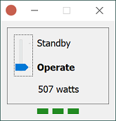
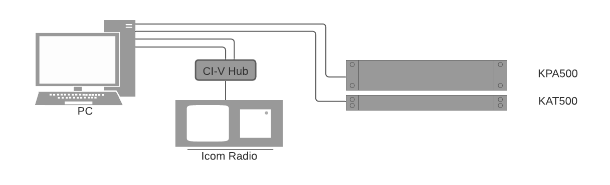
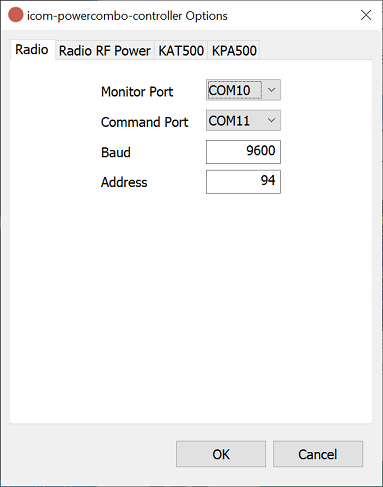
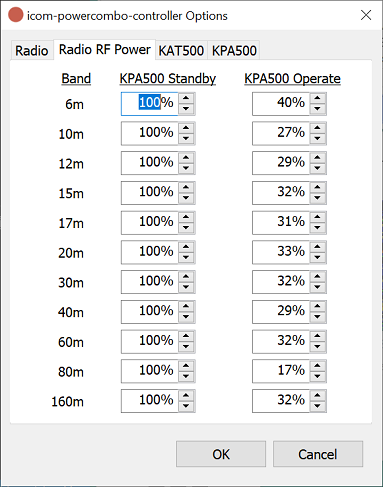
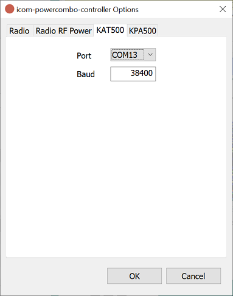
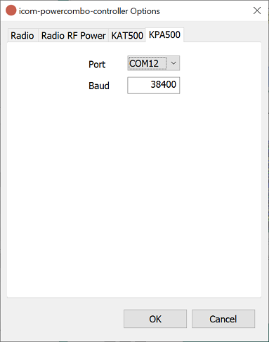

# icom-powercombo-controller

[](https://github.com/bbathe/icom-powercombo-controller/actions) [](https://github.com/bbathe/icom-powercombo-controller/actions)

icom-powercombo-controller is a Windows application that automates the interactions between an [Icom](https://www.icomamerica.com/en/amateur) radio connected to the [Elecraft](https://elecraft.com) KAT500/KPA500 PowerCombo.

&nbsp;
## Description
The icom-powercombo-controller application monitors frequency changes from the radio and coordinates that change across the KAT500 & KPA500 devices.  The user is able to set the radios RF power level for each band, based on wheter the KPA500 is in Standby or Operate.  These RF power level settings allow you to rely on the radios PA and only "turn it up" when band conditions require.

&nbsp;
## User Interface


The interface is very simple.  The user can control whether the KPA500 is in Standby or Operate, monitor the power going out the KPA500 and see the individual status for each device (Radio, KAT500, and KPA500).  The status is determined by the ability to communicate with the device and also the Fault state of the KAT500 & KPA500 devices. 

&nbsp;
## Hardware Connections


Two COM ports on the PC connect to a [CI-V Hub](#References) using [USB CAT cables](#References), the radio is also connected to the hub using an 1/8" mono patch cable.  One of these ports is used to monitor for frequency changes from the radio and the other is used for sending commands to the radio.  Two connections are needed because monitoring for transceive messages from the radio is a blocking operation and we need to be able to send commands outside of any frequency changes.  There is also one connection to the KAT500 and another connection to the KPA500, using the cables provided by Elecraft.  Altogether, this is 4 COM ports used on the PC.

&nbsp;
## Software Installation
To install this application:
1. Create the folder `C:\Program Files\icom-powercombo-controller`
2. Download the `icom-powercombo-controller.exe.zip` file from the [latest release](https://github.com/bbathe/icom-powercombo-controller/releases) and unzip it into that folder
3. You can now double-click on the `icom-powercombo-controller.exe` file to start the application.  Creating a shortcut somewhere or pinning it to your taskbar will make it easier to find in the future.
4. You will be presented with the configuration options to complete the setup.  See [Configuration options](#Configuration-options) below for details.

You can have multiple configuration files and switch between them by using the `config` command line switch:
  ```
  icom-powercombo-controller.exe -config home.yaml
  ```

There will be a log file created in the same directory as the executable and any errors are logged there.

&nbsp;
## Configuration options
The configuration options will display if you start the application and no configuration file was found.  It is also accesible with a right click on the main interface and selecting 'Options...'.

&nbsp;
### Radio


How to connect to the radio
  * Monitor Port: COM port used to monitor for frequency changes from the radio
  * Command Port: COM port used for sending commands to the radio
  * Baud: CI-V baud rate set for Radio
  * Address: Radios CI-V address

&nbsp;
### Radio RF Power


For each band, configure the radios RF power based on whether the KPA500 is in standby or operate mode

&nbsp;
### KAT500


How to connect to the KAT500
  * Port: COM port used for communicating with the KAT500
  * Baud: KAT500 connection baud rate

&nbsp;
### KPA500


How to connect to the KPA500
  * Port: COM port used for communicating with the KPA500
  * Baud: KPA500 connection baud rate

&nbsp;
## References
[BlueMax49ers: USB CAT Cables](https://www.ebay.com/str/bluemax49ers)

[VE2DX Electronics: CI-V Hub](https://ve2dx.com)
